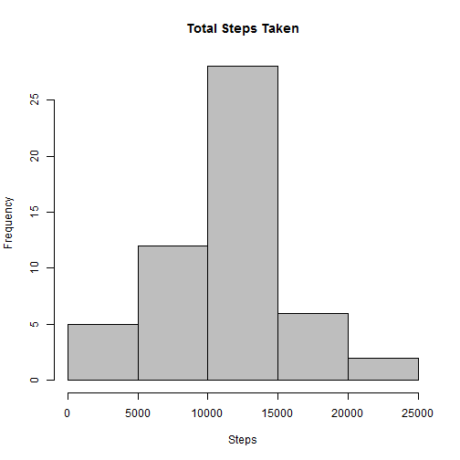
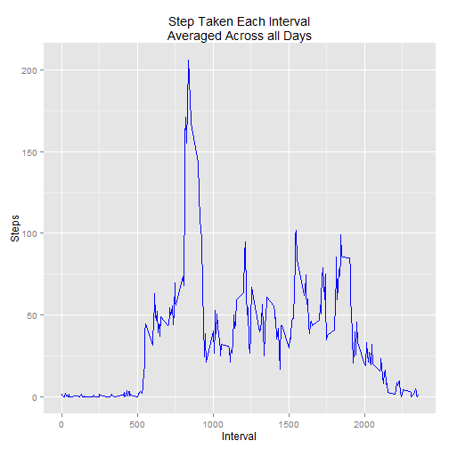
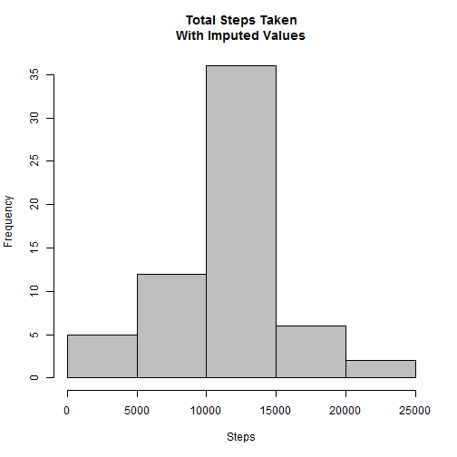
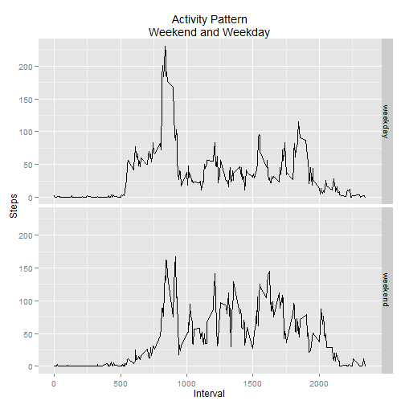

# Reproducible Research: Peer Assessment 1


## Loading and preprocessing the data
First, set your working directory to the downloaded folder. The folder contains the data in a zipped folder, so it must be unzipped before reading into R. After reading into R, take a look at the data to determine if more processing is necessary.  


```r
unzip("activity.zip", files = "activity.csv")
data <- read.csv("activity.csv")
head(data)
```

```
##   steps       date interval
## 1    NA 2012-10-01        0
## 2    NA 2012-10-01        5
## 3    NA 2012-10-01       10
## 4    NA 2012-10-01       15
## 5    NA 2012-10-01       20
## 6    NA 2012-10-01       25
```
  
The data is already tidy and no further processing is necessary.  


## What is mean total number of steps taken per day?
To answer this question, first plot a histogram of the total number of steps taken per day and then find the median and mean.  
To get the total steps taken per day, I used the melt() and dcast() functions from the "reshape2" package to sum the steps by each date. Then plot the histogram

```r
library("reshape2")
datamelt <- melt(data, id = c("date","interval"), measure.vars = "steps", 
                 na.rm = TRUE)  

sumSteps <- dcast(datamelt, date ~ variable, sum)

hist(sumSteps$steps, xlab = "Steps", main = "Total Steps Taken", col = "gray")
```

 
  
Now that we have the sum of steps for each day, we can find the mean and median steps per day.  


```r
# Mean
mean(sumSteps$steps, na.rm = TRUE)
```

```
## [1] 10766
```

```r
#Median
median(sumSteps$steps, na.rm = TRUE)
```

```
## [1] 10765
```


## What is the average daily activity pattern?
To find the average activity pattern, we can start with the data that we had already melted in the last question and recast it, finding the mean steps taken for each time interval. I used "ggplot2" package to plot the activity pattern.  


```r
avgSteps <- dcast(datamelt, interval ~ variable, mean)
head(avgSteps)
```

```
##   interval   steps
## 1        0 1.71698
## 2        5 0.33962
## 3       10 0.13208
## 4       15 0.15094
## 5       20 0.07547
## 6       25 2.09434
```

```r
library("ggplot2")
g <- ggplot(avgSteps, aes(interval, steps))
g + geom_line(colour = "blue")+
        labs(title = "Step Taken Each Interval\nAveraged Across all Days",
             x="Interval", y = "Steps")
```

 
  
The 5-minute interval with the maximum number of steps on average is easy to find once we have the data set. I subset the avgSteps data set by the max() of the variable steps.

```r
avgSteps[avgSteps$steps==max(avgSteps$steps),]
```

```
##     interval steps
## 104      835 206.2
```
  
As shown above, the interval beginning at 8:35 AM has the highest number of steps on average across all days.  

## Imputing missing values
When we looked at the head() of the original data set, it was already apparent that there were a lot of missing values. To find out how many missing values exist for the variable "steps" we can use the is.na() function and count the number of TRUE values.
  

```r
sum(is.na(data$steps))
```

```
## [1] 2304
```
  
So there are 2304 missing values in the data set, which amounts to 8 full days. We can impute data into these missing values to prevent introducing bias into some calculation. My strategy for imputing the data is to replace any NA with the mean number of steps for its time interval. The code below goes through each value in the steps variable. If the value is NA, it finds the mean steps for the time interval in the data set we used for the previous question. The average is added to a new vector "imputedsteps". If the value is not NA, then it is added to the "imputedsteps" vector. I then create a copy of the original data set and replace the steps with the imputed steps.


```r
data$row <- as.numeric(rownames(data))
imputedsteps <- NULL
for (i in data$row){
        if(is.na(data$steps[i])) {
                timeInt <- data$interval[i]
                imp <- avgSteps[avgSteps$interval==timeInt,]$steps
                imputedsteps <- c(imputedsteps, imp)
        } else {
                imputedsteps <- c(imputedsteps,data$steps[i])
        }
}

data2 <- data
data2$steps <- imputedsteps
head(data2)
```

```
##     steps       date interval row
## 1 1.71698 2012-10-01        0   1
## 2 0.33962 2012-10-01        5   2
## 3 0.13208 2012-10-01       10   3
## 4 0.15094 2012-10-01       15   4
## 5 0.07547 2012-10-01       20   5
## 6 2.09434 2012-10-01       25   6
```

Below is the histogram of the data after the missing values were imputed. As you can see, because we replaced the missing values with the average amounts for that time interval, frequency of days with total steps in the median range has increased compared to the histogram of the original data set.


```r
datamelt2 <- melt(data2, id = "date", measure.vars = "steps")
sumSteps2 <- dcast(datamelt2, date ~ variable, sum)
hist(sumSteps2$steps, xlab = "Steps", 
     main = "Total Steps Taken\nWith Imputed Values", col = "gray")
```

 

  
We can then find the median and mean of the imputed data set.   

```r
# Mean
mean(sumSteps2$steps)
```

```
## [1] 10766
```

```r
# Median
median(sumSteps2$steps)
```

```
## [1] 10766
```

Because the missing values were imputed with the average times for each missing interval there was no effect on the mean and minimal effect on the median.

## Are there differences in activity patterns between weekdays and weekends?
Using the imputed data set, we first need to correctly format the date column as a date rather than a factor. I use the lubridate package because of ease of use and personal preference.

```r
class(data2$date)
```

```
## [1] "factor"
```

```r
library(lubridate)
data2$date <- ymd(data2$date)
class(data2$date)
```

```
## [1] "POSIXct" "POSIXt"
```
  
Now that the date column is in the correct format, we can use the weekday() function to determine the days of the week. Since we want to separate the weekends and weekdays, I will assign 1 to days in the weekend and 0 to days in the work week. I then change the weekday vector to a factor and assign levels "weekday" and "weekend" to 0 and 1 respectively.


```r
wday <- as.integer(weekdays(data2$date)=="Saturday"|weekdays(data2$date)=="Sunday")
data2$weekday <- as.factor(as.character(wday))
levels(data2$weekday) <- c("weekday", "weekend")
```

Now that we have a factor denoting which days are weekend days and which are workweek days, we can get the average of each interval for each type of day. I use the melt function and use "weekday" and "interval" as the ids with "steps" as the measured variable. I then use dcast() to cast the data first by weekday type, then by 5-minute interval. The plot is created with ggplot2 using a facet for each weekday type.


```r
weekdaymelt <- melt(data2, id = c("weekday", "interval"), measure.vars = "steps")
avgSteps2 <- dcast(weekdaymelt, weekday + interval ~ variable, mean)
g<-ggplot(avgSteps2, aes(interval, steps))
g+geom_line()+facet_grid(weekday~.)+
        labs(title = "Activity Pattern\nWeekend and Weekday",
             x="Interval", y = "Steps")
```

 
  
As you can see above, the activity patterns are quite different during the weedays and weekends. during the work week, activity begins earlier, most of the activity is found in the beginning of the day, and the max average steps during a 5-minute interval is higher than during the weekend. The weekend activity begins later, and is distributed more evenly throughout the day.
