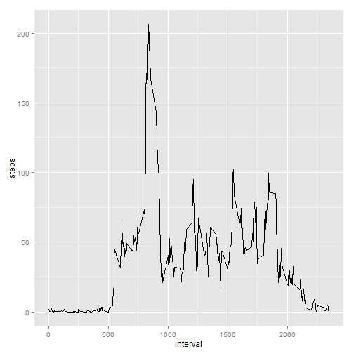

# Reproducible Research: Peer Assessment 1


## Loading and preprocessing the data
First, unzip the .csv file and read it into R.  

```r
unzip("activity.zip", files = "activity.csv")
data <- read.csv("activity.csv")
```

## What is mean total number of steps taken per day?
First sum the number of steps per day.

```r
library("reshape2")
datamelt <- melt(data, id = "date", measure.vars = "steps")
sumSteps <- dcast(datamelt, date ~ variable, sum)
```
Plot

```r
hist(sumSteps$steps, xlab = "Steps", main = "Total Steps Taken")
```

 
  
  
Find the mean and median

```r
mean(sumSteps$steps, na.rm = TRUE)
```

```
## [1] 10766
```

```r
median(sumSteps$steps, na.rm = TRUE)
```

```
## [1] 10765
```


## What is the average daily activity pattern?


```r
datamelt2 <- melt(data, id = "interval", measure.vars = "steps", na.rm = TRUE)
avgSteps <- dcast(datamelt2, interval ~ variable, mean)
```

Make the plot
  

```r
plot(avgSteps, type = "l", main = "Step Taken Each Interval\nAveraged Across all Days")
```

 
  
Find the interval on average across all days contains the maximum number of steps

```r
avgSteps[avgSteps$steps==max(avgSteps$steps),]
```

```
##     interval steps
## 104      835 206.2
```


## Imputing missing values
Calculate the total number of rows with missing values.
The easiest way to do that is to use the is.na() function. Rows that are NA are marked as TRUE or 1, so we can sum those to get the total number of rows containing NAs.
  

```r
sum(is.na(data$steps))
```

```
## [1] 2304
```


```r
data$row <- as.numeric(rownames(data))
```


```r
imputedsteps <- NULL
for (i in data$row){
        if(is.na(data$steps[i])) {
                timeInt <- data$interval[i]
                imp <- avgSteps[avgSteps$interval==timeInt,]$steps
                imputedsteps <- c(imputedsteps, imp)
        } else {
                imputedsteps <- c(imputedsteps,data$steps[i])
        }
}
```
  
The imputed steps can replace the steps in a new data set.  
Create the new data set, then replace the steps with the imputed steps.

```r
data2 <- data
data2$steps <- imputedsteps
```
  
In the original data set, there were 2304 NAs in the steps variable. Count the NAs in the new data set to be sure they were filled in.


```r
sum(is.na(data2$steps))
```

```
## [1] 0
```

  
The reshape the data to get the median and mean.

```r
datamelt2 <- melt(data2, id = "date", measure.vars = "steps")
sumSteps2 <- dcast(datamelt2, date ~ variable, sum)
mean(sumSteps2$steps)
```

```
## [1] 10766
```

```r
median(sumSteps2$steps)
```

```
## [1] 10766
```

The change in data did not have an impact on the average, but it did bring the median up from 10765 to 10766

## Are there differences in activity patterns between weekdays and weekends?
